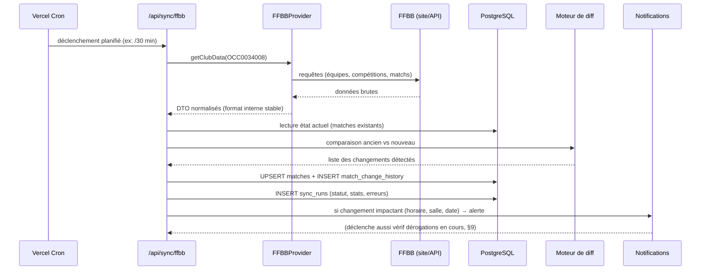
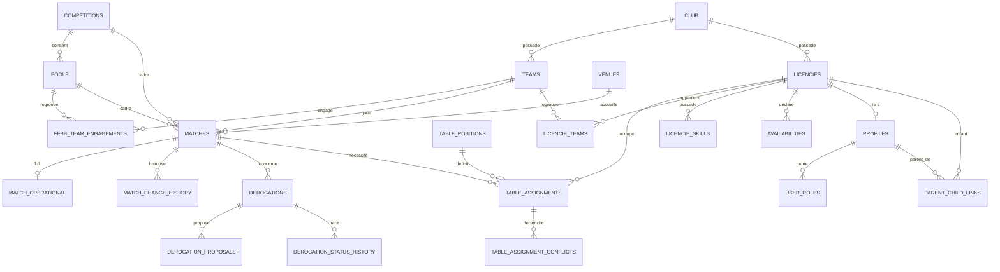

# Architecture — Plateforme SaaS multi-clubs (basket)

> **MULTI-TENANT SAAS.** Ce document décrit l'architecture FONCTIONNELLE
> (modules, flux FFBB, modèle de données métier) qui s'applique À CHAQUE
> CLUB de la plateforme — ce n'est plus une application développée pour un
> seul club. SC Sète Basket (identifiant FFBB `OCC0034008`) est le
> **tenant pilote**, pas une hypothèse câblée dans le code.
>
> Pour le modèle multi-tenant lui-même (isolation, `clubs`,
> `club_memberships`, RLS, routes `/c/{slug}/...`, `/platform`, jobs
> multi-club, onboarding d'un nouveau club) : voir
> **[`docs/MULTI_TENANCY.md`](./docs/MULTI_TENANCY.md)**, qui fait autorité
> sur ces sujets. Toute mention ci-dessous de "le club" désigne UN club
> parmi d'autres sur la plateforme, jamais un singleton.
>
> Règle de développement (voir aussi `docs/MULTI_TENANCY.md`) : **toute
> nouvelle fonctionnalité métier doit être conçue tenant-aware dès le
> départ** (paramétrée par `clubId`, jamais un club implicite global).

## Sommaire

1. [Architecture générale](#1-architecture-générale)
2. [Modules fonctionnels](#2-modules-fonctionnels)
3. [Flux FFBB ↔ application](#3-flux-ffbb--application)
4. [Modèle de données — principes](#4-modèle-de-données--principes)
5. [Tables PostgreSQL principales](#5-tables-postgresql-principales)
6. [Relations entre les tables](#6-relations-entre-les-tables)
7. [Authentification et permissions](#7-authentification-et-permissions)
8. [Stratégie de synchronisation FFBB](#8-stratégie-de-synchronisation-ffbb)
9. [Détection des changements de matchs](#9-détection-des-changements-de-matchs)
10. [Calcul des disponibilités](#10-calcul-des-disponibilités)
11. [Moteur de recommandation des tables](#11-moteur-de-recommandation-des-tables)
12. [Gestion des conflits](#12-gestion-des-conflits)
13. [Organisation du projet Next.js](#13-organisation-du-projet-nextjs)
14. [Tâches cron / workers](#14-tâches-cron--workers)
15. [Points techniques à sécuriser dès le début](#15-points-techniques-à-sécuriser-dès-le-début)
16. [Découpage en phases de développement](#16-découpage-en-phases-de-développement)

---

## 1. Architecture générale

```mermaid
flowchart LR
    FFBB[("FFBB\n(source de vérité)")] -->|scraping / API| SYNC[Service de synchronisation\n(job planifié)]
    SYNC -->|UPSERT idempotent| DB[(PostgreSQL / Supabase)]
    DB --> APP[Application Next.js\n(mobile-first, PWA)]
    APP -->|Auth| AUTH[Supabase Auth]
    APP --> USERS[Utilisateurs :\nadmin, correspondant,\nresponsable tables,\ncoach, joueur, parent]
    SYNC -.->|historique + logs| DB
```

**Choix de stack : validés, avec ajustements mineurs.**

| Brique | Choix | Justification |
|---|---|---|
| Frontend + backend | **Next.js (App Router) + TypeScript** | Un seul repo, SSR pour le mobile-first, API routes pour les endpoints de sync/cron, écosystème mûr. |
| Base de données | **PostgreSQL via Supabase** | Relationnel adapté au modèle (matchs, licenciés, affectations), RLS natif pour les permissions, pas d'infra à gérer. |
| Auth | **Supabase Auth** | Gère comptes, sessions, magic link — suffisant pour une petite structure associative, pas besoin d'un IdP externe. |
| Hébergement | **Vercel** | Déploiement simple, Cron Jobs natifs pour la synchronisation planifiée. |
| Synchronisation FFBB | **Service dédié (module isolé), déclenché par cron** | Voir §8. Pas de queue/broker (Redis, SQS...) : la volumétrie d'un seul club ne le justifie pas. |
| PWA | **next-pwa ou Web App Manifest natif** | Ajout léger, pas de dépendance lourde type React Native tant que le besoin n'est pas prouvé. |

**Ajustements proposés par rapport à l'énoncé :**

- Pas de queue de messages (BullMQ, SQS...) au départ : un run de sync = un job séquentiel, quelques secondes/minutes, largement dans les limites d'une fonction Vercel Cron. On introduira une queue seulement si le volume de clubs/compétitions suivis explose (non prévu ici : un seul club).
- Pas de microservices. Le "service de synchronisation" est un module Node isolé (`/lib/ffbb`) appelé par une route API interne, pas un service déployé séparément. Cela reste évolutif : si un jour on veut l'extraire (Supabase Edge Function, worker séparé), l'isolation du code le permet déjà.
- Recommandation forte : **isoler le code d'accès FFBB derrière une interface `FFBBProvider`** (détaillé en §8) pour ne jamais coupler la logique métier au format brut de l'API/scraping FFBB.

---

## 2. Modules fonctionnels

| # | Module | Résumé |
|---|---|---|
| 1 | **Matchs** | Vue des matchs synchronisés FFBB (dont "Ce week-end"), filtres, historique des modifications. |
| 2 | **Dérogations** | Workflow de demande de changement de date/heure d'un match, avec rapprochement automatique lors d'une synchro FFBB. |
| 3 | **Tables de marque** | Affectation de licenciés aux postes (chrono, marque, e-Marque, responsable salle), historique par licencié. |
| 4 | **Affectation intelligente** | Moteur de recommandation basé sur disponibilité, charge, compétences, buffers temporels. |
| 5 | **Conflits automatiques** | Détection en cascade des conflits générés par un changement FFBB (match déplacé vs. table déjà affectée). |
| 6 | **Utilisateurs & rôles** | Multi-rôles par utilisateur, portée par équipe pour les coachs, rattachement parent/enfant. |
| 7 | **Licenciés** | Référentiel personne distinct du compte utilisateur (un licencié peut ne jamais se connecter). |
| 8 | **Synchronisation FFBB** | Moteur d'ingestion idempotent, logs, détection de changements, couche d'abstraction `FFBBProvider`. |

Ces 8 modules correspondent à 8 "domaines" de code (voir §13) et peuvent avancer indépendamment une fois le socle (Phase 0-2) posé.

---

## 3. Flux FFBB ↔ application



**Principe non négociable :** l'écriture issue de la synchro touche **uniquement** les colonnes "FFBB" des tables concernées. Les données métier internes (table de marque, commentaires, affectations...) vivent dans des tables séparées, jamais dans le chemin d'écriture du sync. C'est une garantie structurelle, pas seulement une règle de code (voir §4-5).

---

## 4. Modèle de données — principes

Deux familles de tables, strictement séparées physiquement :

- **Tables "FFBB"** (`matches`, `competitions`, `pools`, `ffbb_team_engagements`, `match_change_history`, `sync_runs`) : uniquement écrites par le service de synchronisation. Une donnée FFBB a toujours un `ffbb_*_id` externe stable qui sert de clé d'UPSERT.
- **Tables "métier club"** (`match_operational`, `derogations`, `table_assignments`, `licencies`, `availabilities`, `user_roles`, ...) : écrites par les utilisateurs via l'application, jamais par le job de sync.

La jointure entre les deux mondes se fait par clé étrangère vers `matches.id` (identifiant interne, stable, jamais recréé). Ainsi une resynchronisation ne peut **jamais** supprimer ou écraser une ligne `match_operational`, `derogations` ou `table_assignments`, même si tout le reste du match a changé côté FFBB (horaire, salle, adversaire).

Autre principe clé : **on ne garde jamais un `match_id` qui change**. Le sync fait un `UPSERT ... ON CONFLICT (ffbb_match_id) DO UPDATE`, donc l'`id` interne UUID d'un match donné est stable pour toute sa vie, même si sa date/heure/salle changent 10 fois.

---

## 5. Tables PostgreSQL principales

### 5.1 Référentiel club / compétitions (couche FFBB)

```
club
  id, name, ffbb_club_id (unique), created_at

competitions
  id, ffbb_competition_id (unique), name, category, season

pools                                  -- poules
  id, competition_id (fk), ffbb_pool_id (unique), name

teams                                  -- équipes internes du club
  id, club_id (fk), name, category      -- ex: "SM2", "U13F"

ffbb_team_engagements                  -- lien équipe interne <-> engagement FFBB
  id, team_id (fk teams), competition_id (fk), pool_id (fk),
  ffbb_engagement_id (unique), season

venues                                 -- salles (référentiel normalisé, optionnel)
  id, name, address, ffbb_venue_id (nullable)
```

### 5.2 Matchs (couche FFBB — écriture exclusive du sync)

```
matches
  id (uuid, pk)
  ffbb_match_id (text, unique, stable)   -- clé d'upsert
  team_id (fk teams)
  competition_id (fk competitions)
  pool_id (fk pools)
  journee (text/int)
  match_datetime (timestamptz)
  is_home (bool)
  opponent_name (text)
  opponent_ffbb_id (text, nullable)
  venue_id (fk venues, nullable)
  venue_raw_label (text)                 -- libellé brut FFBB si non résolu en venue_id
  score_home (int, nullable)
  score_away (int, nullable)
  status (enum: scheduled, played, postponed, cancelled, forfeit)
  raw_ffbb_payload (jsonb)               -- filet de sécurité / debug
  ffbb_last_seen_at (timestamptz)
  created_at, updated_at

match_change_history                    -- historique des modifications FFBB
  id, match_id (fk matches), sync_run_id (fk sync_runs)
  field_name (text)                      -- ex: "match_datetime", "venue_id"
  old_value (text), new_value (text)
  detected_at (timestamptz)

sync_runs
  id, started_at, finished_at
  status (enum: success, partial, error)
  stats (jsonb)                          -- {created, updated, unchanged, errors}
  error_log (text, nullable)
```

### 5.3 Couche métier club — matchs

```
match_operational                       -- 1-1 avec matches, jamais touché par le sync
  match_id (fk matches, pk)
  table_status (enum: not_needed, to_organize, proposed, confirmed, incomplete)
  correspondent_notes (text)
  created_at, updated_at
```

### 5.4 Dérogations

```
derogations
  id, match_id (fk matches)
  requested_by_licencie_id (fk licencies)
  status (enum: BROUILLON, A_TRAITER, CONTACT_ADVERSAIRE, ACCORD_ADVERSAIRE,
                DEMANDE_FFBB_EN_COURS, VALIDEE, VALIDEE_FFBB, REFUSEE, ANNULEE)
  reason (text)
  original_datetime (timestamptz)        -- snapshot au moment de la demande
  comment (text)
  created_at, updated_at

derogation_proposals                     -- une ou plusieurs propositions
  id, derogation_id (fk), proposed_datetime (timestamptz), comment, rank (int)

derogation_status_history
  id, derogation_id (fk), old_status, new_status,
  changed_by_user_id (fk), changed_at, comment
```

### 5.5 Licenciés, utilisateurs, rôles

```
licencies                                -- personne, existe indépendamment d'un compte
  id, first_name, last_name, birth_date, license_number (nullable),
  email (nullable), phone (nullable), active (bool), club_id (fk)

licencie_teams                           -- m2m, avec rôle contextuel
  licencie_id (fk), team_id (fk), role (enum: player, coach)

licencie_skills
  licencie_id (fk), skill_code (enum: chrono, marque, e_marque, responsable_salle),
  level (enum: debutant, confirme)

profiles                                 -- extension de auth.users (Supabase)
  user_id (pk, fk auth.users), licencie_id (fk licencies, nullable), display_name

user_roles
  id, user_id (fk), role (enum: super_admin, correspondant_club,
                                responsable_tables, coach, joueur, parent),
  scope_team_id (fk teams, nullable)      -- ex: coach limité à ses équipes

parent_child_links
  parent_user_id (fk), licencie_id (fk)   -- enfant rattaché
```

### 5.6 Tables de marque

```
table_positions                          -- postes configurables
  id, code (text, unique), label, requires_skill (bool), min_age (int, nullable)

table_assignments
  id, match_id (fk matches), position_id (fk table_positions)
  licencie_id (fk licencies, nullable)
  status (enum: proposed, confirmed, declined, absent, completed)
  source (enum: manual, auto_suggested)
  proposed_at, confirmed_at

availabilities
  id, licencie_id (fk)
  kind (enum: recurring, exception)
  day_of_week (int, nullable)             -- si recurring
  specific_date (date, nullable)          -- si exception
  start_time, end_time
  is_available (bool)                     -- false = indisponibilité déclarée
  reason (text, nullable)

buffer_config                            -- paramétrage des marges temps
  id, context (enum: home, away), minutes_before, minutes_after

table_assignment_conflicts
  id, assignment_id (fk table_assignments)
  conflict_type (enum: own_match_overlap, unavailable, double_booking)
  detected_at, resolved_at (nullable), resolution (text, nullable)
```

---

## 6. Relations entre les tables



---

## 7. Authentification et permissions

- **Auth** : Supabase Auth (email/mot de passe + magic link). Pas besoin d'OAuth externe pour une petite structure — évite de la complexité inutile.
- **Multi-rôles** : `user_roles` est une table m2m (`user_id`, `role`), pas un champ unique sur `profiles`. Un compte peut être `coach` + `parent`, par exemple.
- **Portée (scope)** : le rôle `coach` porte un `scope_team_id` optionnel pour limiter son accès à ses équipes. `super_admin` et `correspondant_club` n'ont pas de scope (accès global).
- **RLS (Row Level Security) PostgreSQL** comme mécanisme d'autorisation principal, pas seulement la logique applicative :
  - `super_admin` : accès total.
  - `correspondant_club` : lecture/écriture sur `matches` (lecture seule, c'est le sync qui écrit), `match_operational`, `derogations`, `match_change_history`.
  - `responsable_tables` : lecture/écriture sur `table_assignments`, `availabilities` (lecture), `licencie_skills`, stats.
  - `coach` : lecture sur les matchs de ses équipes (`scope_team_id`), création de `derogations` pour ses équipes.
  - `joueur` : lecture de ses propres matchs/affectations, écriture sur ses propres `availabilities`.
  - `parent` : mêmes droits que `joueur`, mais pour les licenciés listés dans `parent_child_links`.
- **Service role key** (Supabase) utilisée **uniquement** côté serveur (job de sync, routes API internes), jamais exposée au client. Le sync bypass les RLS via la service key car il doit pouvoir upserter tous les matchs.
- Un licencié peut exister **sans compte** (`licencies.id` sans `profiles` associé) — c'est la norme pour beaucoup de joueurs, notamment jeunes. Le rattachement à un compte se fait plus tard (auto-inscription avec validation, ou création manuelle par l'admin).

---

## 8. Stratégie de synchronisation FFBB

### 8.1 Couche d'abstraction `FFBBProvider`

```
interface FFBBProvider {
  getClubTeams(clubFfbbId: string): Promise<RawTeamEngagement[]>
  getMatchesForEngagement(engagementId: string): Promise<RawMatch[]>
  getMatchDetails(matchFfbbId: string): Promise<RawMatch>
}
```

- Une seule implémentation concrète au départ (`FFBBHttpProvider` ou `FFBBScrapingProvider`, selon ce que l'accès réel permet).
- Le reste de l'application ne connaît **que** le DTO normalisé (`NormalizedMatch`, `NormalizedTeamEngagement`), jamais le format brut FFBB.
- Si la source FFBB change de structure (API interne modifiée, scraping cassé), seul le `Provider` est réécrit — aucun impact sur le schéma DB ni sur les composants UI.
- `raw_ffbb_payload` (jsonb) est conservé sur chaque match pour absorber les champs non encore mappés et faciliter le débogage/évolution du mapping sans perte de données.

### 8.2 Idempotence

- Clé d'upsert : `ffbb_match_id` (identifiant externe stable fourni par FFBB pour une rencontre).
- `INSERT ... ON CONFLICT (ffbb_match_id) DO UPDATE SET ... WHERE matches.<champ> IS DISTINCT FROM EXCLUDED.<champ>` pour ne toucher `updated_at` que si une valeur a réellement changé.
- Un run de sync peut être rejoué sans effet de bord (recréer les mêmes matchs, dupliquer l'historique).

### 8.3 Cadence et déclenchement

- Vercel Cron déclenche `/api/internal/sync-ffbb` (protégé par un secret, voir §15) toutes les 30 à 60 minutes.
- Chaque run crée une ligne `sync_runs` avec statut et stats (créés / mis à jour / inchangés / erreurs), consultable dans un écran "Suivi FFBB" pour le correspondant club.
- Bouton "forcer une synchro maintenant" réservé à `super_admin` / `correspondant_club` pour le debug — ce n'est pas un import manuel de données, juste un déclenchement anticipé du même pipeline automatique.

---

## 9. Détection des changements de matchs

Pour chaque match retourné par le provider, comparaison champ par champ avec la ligne existante (`match_datetime`, `venue_id`/`venue_raw_label`, `opponent_name`, `score_home`, `score_away`, `status`) :

1. Si le match n'existe pas → `INSERT`, pas d'entrée d'historique (c'est une création, pas un changement).
2. Si un champ suivi diffère → `UPDATE` + `INSERT match_change_history` (un enregistrement par champ modifié).
3. La **nouvelle valeur devient la valeur active** immédiatement (colonnes de `matches`) ; l'ancienne valeur reste consultable dans `match_change_history`.
4. Après écriture, déclenchement de deux vérifications en cascade dans le même run :
   - **Rapprochement dérogation** (§9.1) si `match_datetime` ou `venue_id` a changé et qu'une dérogation est `ACCORD_ADVERSAIRE` ou `DEMANDE_FFBB_EN_COURS` pour ce match.
   - **Recalcul de conflits** (§12) sur les `table_assignments` liées à ce match.

### 9.1 Rapprochement automatique dérogation ↔ changement FFBB

Quand un changement de `match_datetime` est détecté sur un match ayant une dérogation active (statut ∈ {ACCORD_ADVERSAIRE, DEMANDE_FFBB_EN_COURS}) :

- Comparer la nouvelle valeur FFBB à chaque `derogation_proposals.proposed_datetime` de la dérogation (tolérance de quelques minutes).
- Si correspondance → la dérogation passe automatiquement en `VALIDEE_FFBB` (ou en proposition à valider par le correspondant club, configurable — recommandé : auto-transition + notification, plutôt que validation manuelle, car c'est un fait constaté, pas une décision).
- Si pas de correspondance mais dérogation active sur ce match → alerte "changement FFBB inattendu sur un match en dérogation", à traiter manuellement.
- Toute transition automatique est tracée dans `derogation_status_history` avec `changed_by_user_id = NULL` et un commentaire système explicite ("Rapprochement automatique avec la synchro FFBB du run #123").

---

## 10. Calcul des disponibilités

Un licencié est **disponible** pour un créneau donné (poste de table à un match) si, à la conjonction de :

1. **Disponibilité déclarée** (`availabilities`) : pas d'indisponibilité (`is_available = false`) couvrant le créneau ; si des créneaux récurrents positifs existent, ils doivent couvrir le créneau (sinon disponibilité "par défaut" = disponible, sauf configuration contraire).
2. **Absence de conflit avec son propre match** : si le licencié est `player` ou `coach` d'une équipe qui a un match ce jour-là, calculer une fenêtre d'indisponibilité autour de ce match :
   - `indispo_debut = match_datetime - buffer_before`
   - `indispo_fin = match_datetime + duree_estimee_match + buffer_after`
   - `buffer_before` / `buffer_after` viennent de `buffer_config`, sélectionné selon `is_home`/`is_away` **du match du licencié lui-même** (pas du match pour lequel on cherche une table).
3. **Absence de double affectation** : le licencié n'est pas déjà `confirmed`/`proposed` sur une autre table qui chevauche le créneau (en tenant compte du temps de trajet entre salles si elles diffèrent — non implémenté en V1, prévu en évolution, voir §16).
4. **Compatibilité d'âge / compétence** avec le poste (`table_positions.min_age`, `requires_skill` vs `licencie_skills`).

Ce calcul est fait **à la demande** (à l'affichage de la vue "proposer les personnes disponibles"), pas en tâche de fond en continu — plus simple, toujours à jour, coût de calcul négligeable à l'échelle d'un club.

---

## 11. Moteur de recommandation des tables

Flux : le responsable ouvre un match à domicile → clique "Proposer les personnes disponibles" pour un poste donné → le moteur :

1. Récupère tous les licenciés actifs ayant la compétence requise pour le poste (`licencie_skills`).
2. Filtre ceux qui sont **disponibles** au sens du §10 (buffers inclus).
3. Exclut ceux déjà affectés ce même jour à un autre poste incompatible en horaire.
4. Trie les candidats restants par **nombre de tables déjà réalisées** (`table_assignments.status = completed`) croissant — priorité à ceux qui en ont fait le moins, pour équilibrer la charge (cf. besoin "Samy : 5 prévues / 4 réalisées").
5. Retourne une liste ordonnée de suggestions (ex. top 5) affichée au responsable.

**Le moteur ne fait que proposer.** Aucune écriture en base tant que le responsable n'a pas cliqué sur "Valider" un candidat pour un poste — à ce moment seulement, une ligne `table_assignments` est créée/mise à jour avec `source = auto_suggested`, `status = proposed` (puis `confirmed` après confirmation du licencié le cas échéant, selon le workflow choisi en Phase 5-6).

Implémentation : une fonction pure (`suggestAssignees(matchId, positionId): Candidate[]`) côté serveur, testable unitairement sans dépendre de l'UI — c'est la base qui permettra d'affiner les critères (trajet, préférences...) sans casser le contrat.

---

## 12. Gestion des conflits

Déclenchement : après toute synchro FFBB qui modifie `match_datetime`, `is_home`, ou `venue_id` d'un match (§9), et aussi en cas de modification manuelle d'une `availability`.

Algorithme (par match modifié) :

1. Trouver tous les licenciés qui jouent/coachent ce match (`licencie_teams` × `team_id` du match).
2. Pour chacun, récupérer ses `table_assignments` actives (`proposed`/`confirmed`) sur **d'autres** matchs, dans une fenêtre de temps large (même journée a minima).
3. Recalculer la disponibilité (§10) de ce licencié pour chacune de ces affectations avec les **nouvelles** données du match.
4. Si le licencié n'est plus disponible → créer une ligne `table_assignment_conflicts` (`conflict_type = own_match_overlap`), et déclencher immédiatement le moteur de recommandation (§11) pour trouver des remplaçants sur ce poste, en excluant le licencié en conflit.
5. Afficher une alerte consolidée dans l'écran "Suivi FFBB" / notifications du responsable tables : *"CONFLIT TABLE — [Licencié] ne semble plus disponible pour [Match/Poste]. Suggestions : 1. ... 2. ... 3. ..."*.
6. Le conflit reste ouvert (`resolved_at IS NULL`) tant qu'un humain n'a pas réaffecté ou explicitement ignoré l'alerte.

Ce module réutilise entièrement §10 et §11 — aucune logique dupliquée, seulement un déclencheur supplémentaire (post-sync) et une table de suivi des alertes.

---

## 13. Organisation du projet Next.js

```
/app
  /(public)/login, /(public)/register            -- pages non protégées
  /(dashboard)/matches                            -- vue "Ce week-end" + filtres
  /(dashboard)/matches/[id]                       -- détail match, dérogation, tables
  /(dashboard)/derogations
  /(dashboard)/tables                             -- affectations, stats licenciés
  /(dashboard)/licencies
  /(dashboard)/admin/sync                         -- suivi des runs FFBB
  /api/internal/sync-ffbb/route.ts                -- endpoint appelé par le cron
  /api/internal/recompute-conflicts/route.ts      -- optionnel, si recalcul isolé nécessaire

/lib
  /ffbb
    provider.ts            -- interface FFBBProvider
    http-provider.ts        -- implémentation concrète
    normalize.ts             -- mapping brut -> DTO interne
  /domain
    matches/                 -- diff, upsert, change history
    derogations/              -- workflow, rapprochement auto
    tables/                    -- recommandation, buffers, disponibilités
    conflicts/                  -- détection, alertes
  /db
    client.ts (supabase server/client)
    queries/                   -- requêtes typées par domaine
  /auth
    roles.ts, guards.ts

/components                -- UI partagée, mobile-first
/supabase
  /migrations               -- schéma SQL versionné
```

Principe : **un dossier `domain/<module>` par module métier**, avec sa logique pure testable indépendamment de Next.js/Supabase. Les routes `/app` restent fines (appellent le domain layer). Cela permet d'avancer module par module sans réorganiser le projet à chaque étape.

---

## 14. Tâches cron / workers

| Tâche | Fréquence | Déclencheur |
|---|---|---|
| Synchronisation FFBB (matchs, scores, statuts) | Toutes les 30-60 min | Vercel Cron → `/api/internal/sync-ffbb` |
| Nettoyage des `sync_runs` anciens (> 90 jours) | 1x/semaine | Vercel Cron |
| Rappel notifications (ex : table à J-2 non confirmée) | 1x/jour | Vercel Cron |
| Recalcul de conflits | Événementiel (dans le run de sync, pas un cron séparé) | Déclenché en fin de sync si changement détecté |

Pas de worker séparé au départ : tout tient dans des routes API Next.js déclenchées par Vercel Cron. Si la volumétrie augmente fortement (plusieurs clubs, beaucoup plus de matchs), on pourra extraire le sync vers une Supabase Edge Function ou un petit worker dédié — l'isolation en `/lib/ffbb` et `/lib/domain` rend cette migration peu coûteuse le jour venu.

---

## 15. Points techniques à sécuriser dès le début

- **Secret de déclenchement du cron** : la route `/api/internal/sync-ffbb` doit vérifier un header/secret (`CRON_SECRET`) pour ne pas être appelable publiquement.
- **Service role key Supabase** : uniquement en variable d'environnement serveur, jamais dans le bundle client, jamais loguée.
- **RLS activé sur toutes les tables dès la première migration** — ne jamais développer avec RLS désactivé "temporairement", car c'est le mécanisme de sécurité principal.
- **Données personnelles de mineurs** (beaucoup de licenciés seront mineurs) : minimiser les champs collectés, prévoir une politique de rétention, restreindre l'accès aux coordonnées (téléphone/email) au strict nécessaire (RGPD).
- **Idempotence stricte du sync** : ne jamais faire de `DELETE` puis `INSERT` sur les matchs — uniquement `UPSERT` — pour ne jamais perdre les FK vers `derogations`/`table_assignments`.
- **Traçabilité des transitions automatiques** (rapprochement dérogation, résolution de conflit) : toujours horodater et distinguer "changement système" vs "changement humain" dans les tables d'historique.
- **Dépendance FFBB fragile** : le provider doit logguer explicitement les échecs (changement de format non reconnu) plutôt que d'échouer silencieusement ou de corrompre des données ; alerter le correspondant club en cas d'échec de sync répété.
- **Fuseaux horaires** : stocker les dates en `timestamptz`, afficher en heure locale Europe/Paris — piège classique avec les matchs du soir/week-end.
- **Validation des rôles côté serveur**, pas seulement côté UI (les policies RLS sont le filet de sécurité ultime, l'UI n'est qu'un confort).

---

## 16. Découpage en phases de développement

**Phase 0 — Socle technique**
Repo Next.js + TypeScript, projet Supabase, schéma initial (club, teams, matches, sync_runs), déploiement Vercel, RLS de base, CI minimale.

**Phase 1 — Synchronisation FFBB en lecture seule (MVP)**
`FFBBProvider` (implémentation réelle à valider selon l'accès disponible à FFBB), UPSERT idempotent des matchs, cron de synchro, vue "Ce week-end" avec filtres (samedi/dimanche/domicile/extérieur/équipe). Pas encore d'auth avancée ni d'écriture métier.

**Phase 2 — Historique et détection de changement**
`match_change_history`, affichage des modifications sur la fiche match, écran "Suivi FFBB" (statut des runs, erreurs).

**Phase 3 — Utilisateurs, rôles, licenciés**
Auth Supabase, `profiles`, `user_roles`, `licencies`, `licencie_teams`, gestion admin des comptes et rattachements parent/enfant.

**Phase 4 — Dérogations**
Workflow complet, propositions multiples, rapprochement automatique avec la synchro FFBB (§9.1).

**Phase 5 — Tables de marque (gestion manuelle)**
`table_positions`, `table_assignments` en affectation manuelle, historique par licencié (prévues/réalisées/absences), écrans de stats.

**Phase 6 — Disponibilités et moteur de recommandation**
`availabilities`, `buffer_config`, moteur `suggestAssignees` (§11), bouton "Proposer les personnes disponibles".

**Phase 7 — Conflits automatiques**
Détection en cascade post-sync (§12), alertes, suggestions de remplacement.

**Phase 8 — Finitions produit**
PWA (installation mobile), notifications (push ou email), classements FFBB si pertinent, polish UI/UX, tableau de bord global.

Chaque phase est livrable et utile seule (ex. la Phase 1 seule remplace déjà un usage manuel du calendrier FFBB), ce qui permet d'avancer feature par feature sans dépendre d'un "big bang" final.
