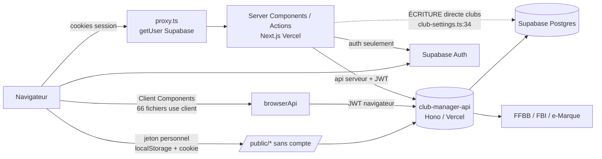

# 01 — Cartographie du repository
_Phase 1, 2026-10-07. Toute affirmation cite `fichier:ligne` ou une commande reproductible. Source complémentaire : `../MIGRATION_TO_API.md`, `../../ARCHITECTURE.md`._

## 1. Arborescence commentée
```
SCSB/
├── src/                      225 fichiers suivis (git ls-files src)
│   ├── app/            50    App Router : /login, /c/[clubSlug]/* (privé), /public/[clubSlug]/* (sans compte), /platform/*
│   ├── features/       78    UI par domaine : admin, matches, tables, derogation-requests, licencies, public-*, results…
│   ├── components/     40    UI partagée (shell, ui, brand)
│   ├── lib/            50    api/ (client club-manager-api), supabase/ (auth), auth/, tenancy/, permissions/, publicToken.ts
│   ├── server/          2    Server Actions : auth.ts, club-settings.ts
│   ├── config/          3    env.public.ts (validation Zod des NEXT_PUBLIC_*), site.ts
│   └── proxy.ts              Garde d'auth (ex-middleware) + refresh session
├── worker/                   Worker Playwright FBI séparé (service role) — documenté OBSOLÈTE, voir §6
├── spikes/                   fbi-auth, ffbb-ecosystem : exploration, hors inventaire (Q-004)
├── scripts/                  api-smoke.ts, generate-api-types.ts (OpenAPI → src/lib/api/generated/schema.ts, 8307 lignes)
├── docs/                     Docs produit + MIGRATION_TO_API.md ; docs/migration/ = ce chantier
└── design-system/, ARCHITECTURE.md, README.md
```
Pas de `.github/` ni de `vercel.json` dans le repo (vérifié) : **aucun CI/CD versionné** côté front.

## 2. Stack actuelle
| Domaine | Valeur | Preuve |
|---|---|---|
| Framework | Next.js 16.3.5 (App Router), React 19.2.8, TypeScript 5 | `package.json` |
| Style / UI | Tailwind 4, lucide-react | `package.json` |
| État | Aucune lib d'état globale ni de cache de requêtes (pas de TanStack Query/SWR/Redux/Zustand) | `package.json` (8 deps prod) |
| Validation | Zod 4 | `src/config/env.public.ts:12` |
| Auth | Supabase Auth (`@supabase/ssr`, `supabase-js`) — session uniquement | `src/lib/supabase/{server,browser}.ts`, `src/proxy.ts:21` |
| Back | **club-manager-api** : Hono/TypeScript sur Vercel Functions, repo séparé, **absent localement** | `ARCHITECTURE.md` §1 (tableau) ; Q-001 |
| BDD | PostgreSQL (Supabase), migrations possédées par club-manager-api | `ARCHITECTURE.md` §1 |
| Hébergement | Vercel (2 projets) | `ARCHITECTURE.md` §1 |
| CI/CD | Aucun fichier versionné | absence de `.github/`, `vercel.json` |
| Tests | Vitest 5 : 18 fichiers / 109 tests, tous sous `src/` ; env `node`, aucun test de composant | `vitest.config.mts`, `07-tests-et-qualite.md` |

## 3. Dépendances
### Production (8) — poids : seul `next/react` pèse côté client
| Paquet | Version | Rôle |
|---|---|---|
| next | 16.3.5 | Framework — **vulnérable (critique)**, voir §3.1 |
| react / react-dom | 19.2.8 | UI |
| @supabase/ssr, @supabase/supabase-js | 0.12.7 / 2.116.0 | Session auth (cookies SSR + navigateur) |
| zod | 4.6.5 | Validation env |
| lucide-react | 1.48.0 | Icônes |
| server-only | 0.0.1 | Garde-fou import serveur |
Dev : eslint 9, eslint-config-next, tailwindcss 4, typescript 5, vitest 5, openapi-typescript 7, tsx.

Poids de référence (build du 2026-10-07, variables factices) : `.next/static/chunks` = 2 264 Ko sur disque (somme de tous les chunks, **non gzippé, toutes routes confondues**) ; plus gros chunks 394 / 267 / 229 Ko. À affiner en Phase 2 (mesure par route) → `08-metriques.md`.

### 3.1 Vulnérabilités de PRODUCTION (LOT-00) — `npm audit --omit=dev`
| Paquet | Sév. | Avis (CVE/GHSA) | Chemin | Plage vulnérable | Correctif | Risque de casse | Exploitabilité ici |
|---|---|---|---|---|---|---|---|
| next | **Critique** | GHSA-vcvr-r3jv-pc5j — RCE dans `next/og` `ImageResponse` | direct (`package.json`) | >=16.2.0 <16.3.6 | 16.3.6+ ; `npm audit` propose **16.4.0** (non-major) | Faible (patch/minor) mais passer le build + 109 tests ; relire les notes de version (AGENTS.md : Next a des breaking changes) | **Faible en l'état** : aucun usage de `next/og`/`ImageResponse` dans `src/` (grep). À corriger quand même : le paquet est exposé et la plage est large. |
| sharp | Haute | GHSA-wq5f-xc86-pv6w, CVE-2026-96889 — librsvg | indirect : `next@16.3.5 → sharp@0.35.4` (optionnel) | <0.35.5 | 0.35.5 existe sur npm ; fix auto via `npm audit fix` ou via la montée de Next | Faible | Moyenne : `next/image` est utilisé (`src/components/brand/BrandMark.tsx:1`), sharp traite des images ; la faille touche le rendu SVG. À vérifier : sources d'images servies. |
| source-map-js | Haute | GHSA-68fv-2mgg-jv7q — DoS boucle d'événements (source maps) | indirect : `@tailwindcss/postcss → source-map-js@1.2.1` et `postcss → source-map-js` | 1.0.0–1.2.1 | 1.2.2 existe | Très faible | Très faible : outillage de build, pas de runtime d'application. |
Dev (consignées, hors lot) : `@next/eslint-plugin-next`, `eslint-config-next`, `braces`, `fast-glob`, `micromatch` (haute). ⚠️ `npm audit` propose pour eux « fix 14.2.35 » = **rétrogradation majeure de Next : à ne PAS appliquer**.
`worker/` : `npm audit --package-lock-only` → 0 vulnérabilité (prod et dev).

## 4. Flux de données
Toute donnée métier passe par `apiFetch` (`src/lib/api/client.ts:45`) → club-manager-api, avec `Authorization: Bearer <JWT Supabase>` (`client.ts:54-56`), `cache: "no-store"` par défaut (`client.ts:67`), timeout 20 s (`client.ts:31`). Deux fabriques : `api` serveur (`src/lib/api/server.ts:37`, 401 → redirect `/login`) et `browserApi` navigateur (`src/lib/api/browserClient.ts:54`, 1 refresh puis redirect).


- **Lecture directe BDD hors API : une seule**, écriture `clubs` : `src/server/actions/club-settings.ts:34-37` (`BACKEND_API_GAP`, `MIGRATION_TO_API.md` catégorie D). Aucun autre `.from()/.rpc()/.storage` dans `src/` (grep).
- **Aucun `fetch()` hors client central** : seul `src/lib/api/client.ts:60` (grep).
- **Stockage navigateur** : jeton public `localStorage` `scsb:public-token:<slug>` (`src/lib/publicToken.ts:13,19,28,37`) ; cookie « known » (`src/features/public/PublicIdentityProvider.tsx:46`).
- **Auth** : `proxy.ts:37-47` appelle `supabase.auth.getUser()` (aller-retour réseau Supabase) à **chaque** requête hors assets ; `requireUser()` (`src/lib/auth/session.ts:29`) ré-appelle `getUser()` ; `getUserClubs` est dédupliqué par `cache()` (`src/lib/tenancy/club-context.ts:24`). Pas encore évalué : coût cumulé → Phase 2.
- **Autorisation** : `requireClubAdminContext` / `requireAnyClubRoleContext` testent les rôles côté Next (`club-context.ts:43-67`) ; `club.roles` vient du back. L'API revérifie (« même porte d'entrée que club-manager-api », `club-context.ts:56`) — **à confirmer côté back (Q-001)**.
- **Calculs côté front repérés (candidats Phase 2, non évalués ici)** : `group-by-day.ts:13-34`, `match-filters.ts`, `result-groups.ts`, `VenuePlanning.tsx`, `DaySummary.tsx`, `HomeMatchesAgenda.tsx`, pages `admin/stats`, `admin/issues`, `dashboard`, `platform/clubs` (grep `reduce|sort|filter`).

## 5. Points d'entrée
- **Routes** (37 `page|layout`, `find src/app`) : `/` · `/login` · `/platform/clubs` · `/c/[clubSlug]/{dashboard, matchs[/id], resultats, tables[/public-access], joueurs[/licencieId], derogations[/nouvelle|/requestId], admin/{derogations,gymnases,integrations[/fbi],issues,settings,stats,sync,teams}}` · `/public/[clubSlug]/{accueil, connexion, matchs[/id], resultats, tables, derogations[...]}`.
- **Racines** : `src/app/layout.tsx`, `src/app/c/[clubSlug]/layout.tsx`, `.../admin/layout.tsx`, `src/app/platform/layout.tsx`, `src/app/public/[clubSlug]/layout.tsx`.
- **Garde** : `src/proxy.ts` ; routes publiques = `PUBLIC_PATHS = ["/login", "/public"]` (`src/config/site.ts:21`).
- **Server Actions** : `src/server/actions/auth.ts`, `club-settings.ts`.
- **Scripts** (`package.json`) : `dev/build/start/lint/typecheck/test`, `api:generate`, `api:smoke`, `fbi:*` (spikes).
- **Route Handlers** : aucun (`src/app/api` n'existe pas).

## 6. Configuration & secrets
### 6.1 Variables `NEXT_PUBLIC_*` réellement utilisées (inventaire exhaustif)
Grep `NEXT_PUBLIC_|process.env` sur `src scripts next.config.ts vitest.* worker/src` (hors tests) :
| Variable | Lue (fichier:ligne) | Consommée par | Nature | Verdict |
|---|---|---|---|---|
| `NEXT_PUBLIC_SUPABASE_URL` | `src/config/env.public.ts:50` (schéma :12) | `proxy.ts:21`, `supabase/server.ts:20`, `supabase/browser.ts:11` | URL publique | ✅ non secret |
| `NEXT_PUBLIC_SUPABASE_ANON_KEY` | `env.public.ts:51` (schéma :15) | idem | clé **anon** (soumise à la RLS) | ✅ publique par conception (`.env.example` le dit) |
| `NEXT_PUBLIC_CLUB_MANAGER_API_URL` | `env.public.ts:52` (schéma :24) | `src/lib/api/config.ts:8`, `scripts/api-smoke.ts:11` | URL publique | ✅ non secret |
Une seule lecture de `process.env.NEXT_PUBLIC_*` par variable, centralisée dans `env.public.ts:50-52`. Autre variable : `CLUB_MANAGER_OPENAPI_URL` (`scripts/generate-api-types.ts:30`), script dev uniquement.

### 6.2 Vérification « aucun secret côté client »
- **Aucune clé `service_role`, `CRON_SECRET`, clé de chiffrement FBI dans `src/`** : ces noms n'apparaissent que dans `vitest.setup.ts:11-14` (valeurs factices de test, jamais bundlées) et dans `worker/src/config.ts:35-44`.
- Aucune clé en dur détectée par grep `service_role|secret|api_key` dans `src/` (hors commentaires/tests) ; `.env*` est ignoré par git (`.gitignore:34`) ; `.env.example` ne contient que des placeholders.
- ✅ **Pas de secret exposé côté client.** Le vrai `.env.local` n'a pas été lu.

### 6.3 Éléments de dette de configuration (non sécuritaires)
- `next.config.ts:3-17` référence `@napi-rs/canvas`, `tesseract.js` et `src/server/emarque/ocr-data/**` : **ce dossier n'existe plus** et ces paquets ne sont plus dépendances (`package.json`). Config **morte** résiduelle de la première migration.
- `vitest.setup.ts:11-14` définit des variables serveur qui n'existent plus dans l'app.
- `src/proxy.ts:55-58` et `supabase/server.ts:15` commentent des chemins (`/api/internal`, `src/middleware.ts`) obsolètes.

### 6.4 `worker/` (périmètre complet, Q-004)
- Service Node/Playwright autonome : `SUPABASE_SERVICE_ROLE_KEY` + `FBI_CREDENTIALS_ENCRYPTION_KEY` requis (`worker/src/config.ts:35-44`, `worker/.env.example`).
- `docs/FBI_WORKER.md:3-13` le déclare **OBSOLÈTE** : « jamais déployé en production sous cette forme… n'existe plus dans ce repository » — **or le dossier `worker/` y est toujours** (tracked, 40+ fichiers, avec Dockerfile et tests). Contradiction → **Q-005**. Il n'est pas importé par l'app (aucun import `worker/` dans `src/`).
- Un secret `service_role` n'est jamais commité (`.gitignore`, `worker/.gitignore`) — non vérifié dans l'historique git : à faire en Phase 2 si souhaité (Q-006).

## 7. Constats clés Phase 1 (hors vulnérabilités)
1. Le front est déjà « mince » côté données : un seul client HTTP, un seul accès BDD direct (`club-settings.ts:34`).
2. Le gros reste potentiel est dans les **transformations d'UI sur des listes** (§4) et dans les **appels en cascade côté serveur Next** (pages composant plusieurs `api.*`) → à inventorier en Phase 2.
3. Dette morte : `worker/`, `next.config.ts`, `vitest.setup.ts`, commentaires obsolètes → candidats à un lot « nettoyage ».
4. Pas de CI versionné, pas de test de composant.

## 8. Déploiement actuel du front (Q-013) — déduit **uniquement** des indices du dépôt
_Méthode : `git ls-files` (Dockerfile, docker-compose, ecosystem/pm2, nginx, Caddy, systemd, deploy*, vercel/railway/fly/render) et `git grep` (README, ARCHITECTURE, docs/, package.json, next.config.ts). Recherche faite le 2026-10-07 sur la branche `refactor/migration-back`._

**Conclusion : le dépôt documente Vercel, de façon cohérente et répétée, et ne contient aucune trace de VPS.** *(Confirmé par le propriétaire le 2026-10-07 : le front est déployé sur Vercel ; la mention « VPS » de Q-007 était erronée.)*

| Indice | Preuve | Ce que cela indique |
|---|---|---|
| Hébergement déclaré : Vercel, projet séparé de `club-manager-api` | `README.md:15` (« SCSB (Next.js/Vercel) »), `README.md:51` (« Déploiement visé : Vercel — projet séparé »), `README.md:217-218` (variables « du projet sur Vercel (production) », « Connecter CE repository à un projet Vercel séparé »), `ARCHITECTURE.md:78` (« Hébergement \| Vercel \| Deux projets séparés ») | Cible documentée = Vercel |
| Dossier `.vercel` ignoré | `.gitignore:38-39` | Outil Vercel utilisé en local (au minimum prévu) |
| Commentaires de code supposant le runtime Vercel | `src/lib/timezone.ts:34` (« UTC sur Vercel »), `src/features/matches/match-display.tsx:11`, `src/features/admin/DerogationsList.tsx:16`, `src/lib/logger.ts:4` (« logs Vercel »), `src/lib/api/client.ts:25` (« jusqu'à ce que Vercel tue la Function ») | Le code a été écrit et débogué sur Vercel (production constatée) |
| Scripts : `next build` / `next start` | `package.json:7-8` | Compatible avec un Node auto-hébergé, mais n'indique rien en soi |
| Pas de mode `standalone` | `next.config.ts` ne contient pas `output` (seulement `serverExternalPackages` et `outputFileTracingIncludes`, `:7,16`) | Aucune préparation d'image Docker minimale pour le front |
| **Aucun** artefact de serveur auto-hébergé | absents de `git ls-files` : `docker-compose*`, `ecosystem.config.*`, `nginx*`, `Caddyfile`, `*.service`, `deploy*`, `Procfile`, `vercel.json`, `railway.json` | Aucune trace de déploiement VPS ni d'un `vercel.json` (les crons ont migré vers `club-manager-api`, `docs/MIGRATION_TO_API.md:68`) |
| Seul fichier Docker : celui du worker FBI | `worker/Dockerfile:1-24` (image Playwright, port 8080, healthcheck `/health`) | Prévu pour Railway (`docs/FBI_WORKER.md:76`, `worker/.env.example:2`) mais **jamais déployé** : `docs/FBI_WORKER.md:250-253`, et le document est déclaré obsolète (`docs/FBI_WORKER.md:3-13`) |
| Railway déjà envisagé pour un worker | `docs/FBI_WORKER.md:4,10,34,76`, `ARCHITECTURE.md:496-509` (décision finale : pas de worker, crons Vercel) | Railway n'est pas nouveau dans le projet ; il n'a jamais servi |
| CI | `.github/workflows/ci.yml` (vérifications seulement, ajouté par LOT-11) | Aucun déploiement automatisé |

**Correction (2026-10-07)** : l'écart signalé plus tôt avec la déclaration « VPS » (Q-007) est levé par le propriétaire (Q-017) : **front sur Vercel**. Aucune configuration serveur hors dépôt n'est à auditer pour le front.