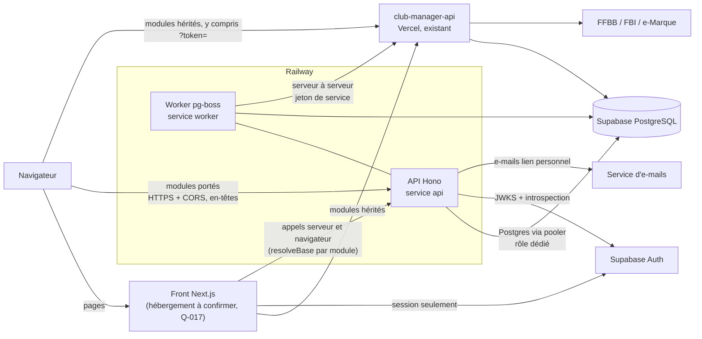
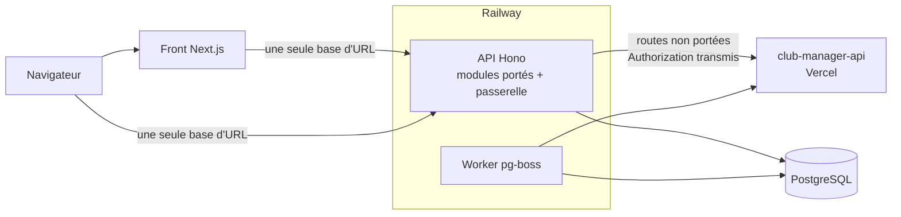
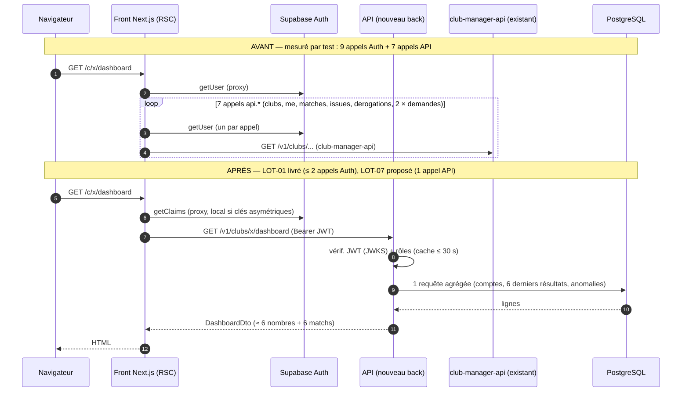
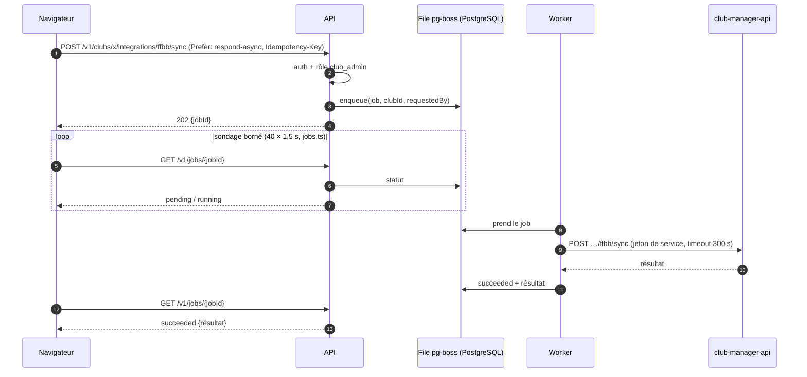
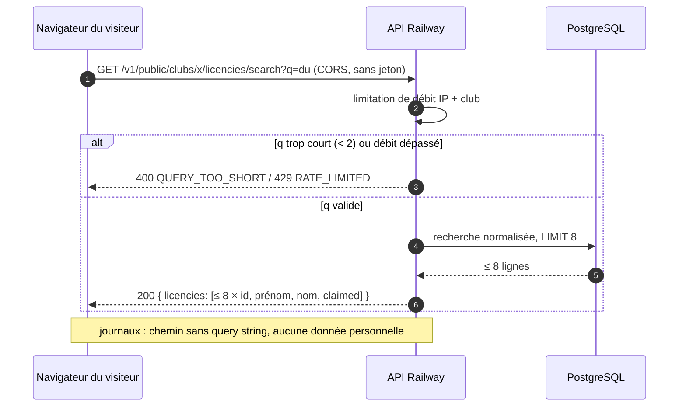
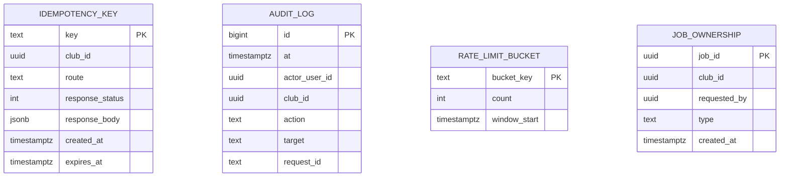

# 05 — Architecture cible du nouveau back
_Phase 3, 2026-10-07, **révisée le même jour pour Railway** — proposition en attente de validation 🛑 (Q-014 à Q-017 ouvertes ; Q-011 = S3 et Q-012 = Railway décidées)._
_Révision : le nouveau back est hébergé sur **Railway** (le front est sur **Vercel**, Q-017) ; la coexistence S3 n'a plus de reverse proxy commun (ADR-005) ; la base peut rester chez Supabase ou aller chez Railway (Q-015, ADR-003)._ Documentation seule : aucun repository créé, aucun code back. Les chiffres de volumétrie sont **estimés** (Q-010 : « garde tes estimations »)._

**Cadrage (Q-002 rouverte)** : la Phase 3 conçoit un **nouveau back**, dans un repository dédié. Le contrat actuellement consommé par le front (`04-contrats-api.md` §A, 92 opérations) est la **contrainte de compatibilité** de départ ; `club-manager-api` n'a pas été lu et reste, par défaut, propriétaire des intégrations (ADR-005).

## 1. Besoins (mesurés en Phase 2 / issus du contrat)
| Charge | Preuve | Besoin pour le back |
|---|---|---|
| Lectures club authentifiées, multi-tenant | 60+ opérations `/v1/clubs/{clubId}/…` (`04` §A.2) | Auth + rôles par club à chaque requête ; 404 identique club inconnu / non membre (`club-context.ts:29-33`) |
| Agrégations pour l'accueil et les résultats | TRT-005/009 (`dashboard/page.tsx:61-102`, `result-groups.ts:33-70`) | Requêtes SQL agrégées, un appel par page |
| Espace public sans compte, données de mineurs | TRT-001, R-013, E-4 | Recherche limitée, limitation de débit, jeton hors URL |
| Opérations longues (30 à 280 s) | TRT-004 (`integrations.ts:64-138`) | `202 + jobId`, worker, idempotence |
| Règles temporelles (saison, journée, DST) | TRT-007/008/012 | Un seul module de dates, `club.timezone` (D-2) |
| Intégrations externes (FFBB, FBI headless, e-Marque, e-mails) | `ARCHITECTURE.md` §1, `FBI_WORKER.md` | Rester chez `club-manager-api` (S1) ; adaptateur côté jobs |
| Volumétrie | **estimée** : quelques clubs, ≤ ~500 matchs/saison/club, ≤ ~1 000 licenciés/club ; quelques dizaines d'utilisateurs actifs | Un seul serveur suffit ; pas de cache distribué ni de bus de messages |

## 2. Stack proposée (5 lignes)
1. **TypeScript + Hono sur Node 24**, OpenAPI généré par Zod (`@hono/zod-openapi`) — ADR-002.
2. **PostgreSQL Supabase conservé par défaut** (Q-015), accès SQL typé **Kysely + `pg`** via le pooler Supavisor (mode session), rôle dédié, tables propres dans un schéma séparé — ADR-003.
3. **Jobs `pg-boss`** (file dans Postgres), worker = même image — ADR-004.
4. **Coexistence S3** (puis remplacement progressif) avec `club-manager-api`, **routage par module dans le client front** (option (c) : (a) maintenant, passerelle plus tard) — ADR-005 ; **le trafic à jeton ne transite jamais par Railway** (R-014).
5. **JWT Supabase revalidé côté back** (JWKS + introspection des écritures sensibles), jeton personnel haché et transporté **en en-tête** — ADR-006 ; **hébergement Railway** : Dockerfile, services `api` + `worker`, environnements `staging` + `production` — ADR-007 ; base Supabase conservée par défaut, **Q-015 ouverte** (ADR-003).

## 3. Architecture globale
### 3.1 Phase de coexistence — option (a) d'ADR-005 (recommandée : routage par module dans le client front)

Le trafic portant `?token=` (modules hérités) va **directement** à Vercel : il ne traverse pas Railway (R-014, ADR-007 §7).

### 3.2 Variante ultérieure — option (b) (passerelle), seulement si les conditions d'ADR-005 §(c) sont réunies

Prérequis : jeton personnel en en-tête partout, plus de requêtes longues synchrones, > 50 % du trafic déjà porté (estimé), disponibilité mesurée.

## 4. Séquences avant / après
### 4.1 Tableau de bord d'un club_admin (TRT-002 + TRT-005)

_`L` (club-manager-api) n'intervient que dans l'état « avant »._

### 4.2 Opération longue en job asynchrone (TRT-004, ADR-004)


### 4.3 Recherche publique de licenciés (TRT-001, LOT-02)


## 5. Modèle de données (tables **propres** au nouveau back — proposition)
Les tables métier existantes (matchs, licenciés, clubs…) restent chez leur propriétaire (ADR-003) ; le nouveau back n'ajoute qu'un schéma `api2` minimal, plus le schéma `pgboss` géré par la bibliothèque.

- `JOB_OWNERSHIP` relie un `jobId` (pg-boss) à son demandeur pour autoriser `GET /v1/jobs/{jobId}` (B.8). `RATE_LIMIT_BUCKET` n'est nécessaire que si plusieurs instances partagent les limites ; **une seule instance** → compteurs en mémoire (par défaut). `AUDIT_LOG` : actions sensibles (écritures FBI, liens personnels), **sans donnée personnelle dans `target`** (identifiants opaques).

## 6. Découpage en modules (domaines)
| Module | Contenu | Endpoints (04) | Lots |
|---|---|---|---|
| `public-access` | recherche licenciés, jeton perso, request-link, home, me | `04` B.1, B.9 | LOT-02, LOT-14 |
| `matches` | liste filtrée/paginée, saison, `weekendKey`, weekends | `04` B.3 | LOT-05/06 |
| `dashboard` | agrégats par rôle | B.5 | LOT-07 |
| `results` | groupes, bilans, classements | B.6 | LOT-08 |
| `licencies` | import texte, auto-assign (job) | B.7 | LOT-09 |
| `venues` | gymnases, rapprochement match↔gymnase | B.2 | LOT-03 |
| `jobs` | enqueue, statut, adaptateurs `club-manager-api` | B.8 | LOT-10 |
| `clubs` | lecture ; l'écriture reste `PATCH /v1/clubs/{id}` existant (E-2) | B.4 | LOT-04 (front) |
| `platform` | `/v1/platform/*` | — | hors lots |
| `shared` | auth, rôles, dates/fuseau, erreurs, pagination, logs | B.11 | tous |

## 7. Authentification et autorisation (ADR-006)
- Chaque requête : **extraction du Bearer → vérification JWKS** (`exp`, `iss`, `aud`) → résolution `(userId)` → **rôles lus en base** pour `(userId, clubId)` (cache ≤ 30 s, estimé) → décision ; introspection `/auth/v1/user` (cache ≤ 10 s) pour les écritures sensibles → **R-011 refermé sur ces actions**.
- Routes publiques : liste blanche explicite ; jeton personnel **haché** en base, comparaison à temps constant, transport par en-tête (E-4/R-014).
- Défense en profondeur : validation Zod de chaque entrée ; CORS en liste blanche ; limitation de débit (publique : par IP et par club ; `request-link` : par licencié) ; `404` identique club inconnu / non membre ; messages d'erreur sans fuite d'information ; journaux sans jeton ni donnée personnelle.
- **Exigence R-013** : tout endpoint public nouveau est conçu sans énumération (longueur minimale, plafond de résultats, pas de total).
- Test de sécurité automatique : énumérer toutes les routes et vérifier qu'aucune n'est publique hors liste blanche ; matrice « rôle × route » (200/403/404).

## 8. Pagination et filtrage serveur
- **Compatibilité** : `limit`/`offset` + `pagination:{limit,offset,total}`, `limit` ≤ 200 (`matches.ts:56-75`) ; les filtres existants `period/teamId/homeAway/status/from/to` sont **déjà** supportés (E-3) → le front peut les utiliser sans attendre.
- **Nouvelles listes** : même forme `offset` (cohérence), `limit` ≤ 100 par défaut 50 ; tri **explicite et stable** (pas de « 50 plus anciens » implicite, piège `matches.ts:40-52`). Curseur seulement si une liste dépasse ~10 000 lignes (non prévu).
- **Cache HTTP** : `Cache-Control: no-store` partout (multi-tenant, `client.ts:64-67`) ; exception **à valider** : lectures publiques sans jeton (matches/standings) avec `public, max-age=30` pour absorber la charge.

## 9. Jobs longs (ADR-004) et fuseau
- **Jobs** : `Prefer: respond-async` → 202 ; statuts `pending|claimed|running|succeeded|failed` ; `Idempotency-Key` ; concurrence 2, délai 300 s, 3 essais (réseau seulement), **aucun rejeu automatique des écritures FBI** ; alertes : profondeur de file et âge du plus vieux job ; planifications récurrentes via `pg-boss` (les crons Vercel restent chez `club-manager-api`).
- **Fuseau (D-2)** : stockage **UTC** ; `club.timezone` validé IANA à l'écriture (E-2) avec repli `Europe/Paris` s'il est absent ; **un seul module `shared/time`** (journée, samedi de référence, saison 1ᵉʳ août, conversions DST-safe) ; l'API renvoie des ISO UTC + `weekendKey` calculé côté back ; tests aux limites (31 juillet/1ᵉʳ août, passage à l'heure d'été/hiver). Les 28 occurrences `Europe/Paris` du front sont traitées dans le lot LOT-05, pas avant.

## 10. Hébergement Railway (ADR-007) — ce que cela implique
| Sujet | Exigence |
|---|---|
| Build | **Dockerfile** multi-étapes (`node:24-slim` épinglé par digest, non-root) ; **pas de `railway.json`** (déprécié, échéance 2026-12-01) ; Nixpacks non sélectionnable ; Railpack = alternative écartée |
| Services | `api` et `worker` (même image, commandes différentes) × environnements `staging` + `production` |
| Déploiement | branche `release` + **« Wait for CI »** ; promotion manuelle ; retour arrière = redéployer le commit précédent (cohérent avec Q-007) |
| Secrets | variables de service Railway par environnement, jamais dans le dépôt/l'image/les logs ; rotation documentée ; « variables scellées » : à vérifier |
| Réseau | HTTPS fourni par Railway ; **CORS en liste blanche** sur le domaine du front (obligatoire en option (a)) ; domaine propre + TLS : à vérifier |
| Healthchecks | `GET /health` **uniquement au déploiement** (Railway ne surveille pas en continu) ; **supervision externe** de `GET /ready` + battement du worker |
| Journaux (R-014) | non-journalisation de la query string **non garantissable par Railway** → garantie **par conception** : `400 TOKEN_IN_QUERY`, aucun trafic à jeton sur Railway, logs applicatifs sans query ; **vérification en staging** avec une valeur sentinelle |
| Base | Supabase via pooler **session** (IPv4) par défaut ; co-localisation des régions à mesurer ; options (b)/(c) d'ADR-003 |
| Limites | requête HTTP : 15 min max / 5 min sans données ; 32 Ko d'en-têtes (vérifiés) ; latence Railway↔Supabase, tarifs, IPv6 sortant : **non vérifiés** |

## 11. Observabilité et erreurs
- Journaux JSON (pino) : `requestId`, `userId` opaque, `clubId`, route, statut, durée ; **jamais** de jeton, e-mail, nom, licence.
- Enveloppe d'erreur **inchangée** (`{error:{code,message,details?}}`, `errors.ts:3-58`) ; registre de codes versionné (reprend ceux listés en `04` §A.1 + `QUERY_TOO_SHORT`, `RATE_LIMITED`, `GONE`).
- Métriques minimales : latence p95 par route, taux 5xx, profondeur de file, âge du plus vieux job ; traces OpenTelemetry **optionnelles** (non justifiées à cette charge).

## 12. Proposition d'arborescence du nouveau repository (non créé — voir `11-init-repo-back.md`)
```
<nouveau-repo>/                       # créé par le propriétaire ; nom à décider
├── README.md · package.json · tsconfig.json · vitest.config.ts
├── Dockerfile                        # image unique, commandes api | worker (aucun railway.json)
├── .github/workflows/ci.yml          # typecheck, lint, test, build image, audit, gitleaks (même base que SCSB)
├── ops/
│   ├── railway.md                    # réglages du tableau de bord (services, variables, domaines, healthcheck, Wait for CI)
│   ├── runbook.md                    # déploiement, retour arrière, rotation des secrets, vérification query string
│   └── contract/ported-routes.json   # liste explicite des préfixes portés (consommée par les tests du front, ADR-005)
├── docs/                             # ADR du back, openapi.json exporté
├── scripts/                          # smoke (équivalent api-smoke), génération des types BDD
├── src/
│   ├── server.ts                     # entrée API (Hono + @hono/node-server, PORT fourni par Railway)
│   ├── worker.ts                     # entrée worker (pg-boss)
│   ├── app.ts                        # assemblage des modules, middlewares globaux (CORS, auth par défaut, 400 TOKEN_IN_QUERY)
│   ├── config/                       # env.ts (Zod) ; jamais process.env ailleurs
│   ├── shared/
│   │   ├── auth/                     # jwks.ts, introspection.ts, requireUser.ts, requireClubRole.ts, personal-token.ts
│   │   ├── http/                     # error-envelope.ts, pagination.ts, rate-limit.ts, request-id.ts, cors.ts
│   │   ├── time/                     # timezone.ts, season.ts, weekend.ts (+ tests DST)
│   │   ├── db/                       # kysely.ts, types.generated.ts
│   │   └── log/                      # pino, redaction (jamais de query string)
│   ├── modules/
│   │   ├── public-access/ · matches/ · dashboard/ · results/ · licencies/ · venues/ · clubs/ · platform/
│   │   └── jobs/                     # routes.ts, queue.ts, handlers/, adapters/club-manager-api.ts
│   └── migrations/                   # SQL du schéma api2 seulement (ADR-003)
└── test/
    ├── contract/                     # parité avec le contrat actuel du front
    ├── security/                     # routes publiques = liste blanche, matrice rôle × route, anti-énumération, refus du jeton en query
    └── integration/                  # base Postgres de test, jobs, pg-boss derrière pooler
```
Conventions : un module = `routes` (HTTP + Zod) → `service` (règles) → `repo` (Kysely) ; aucun accès BDD dans `routes` ; erreurs métier typées → enveloppe unique ; routes sous `/v1` ; `camelCase` comme le contrat actuel.

## 13. Hypothèses explicites et limites
- Aucune lecture du code de `club-manager-api` : tout ce qui le concerne vient des commentaires du front (`integrations.ts`, `matches.ts`…) et de `docs/` ; il peut déjà avoir certains des comportements proposés (ex. limitation de débit).
- Base : Supabase par défaut, **Q-015 ouverte** ; clés JWT et durée de vie inconnues (Q-008).
- Railway : région, latence vers Supabase, IPv6 sortant, TLS du domaine propre, tarifs : non vérifiés ; front : hébergement réel inconnu (Q-017).
- Aucune mesure de latence réseau (Railway↔Supabase, Railway↔Vercel) ; toutes les valeurs de limites (débit, TTL de cache, concurrence) sont **estimées** et à calibrer.
